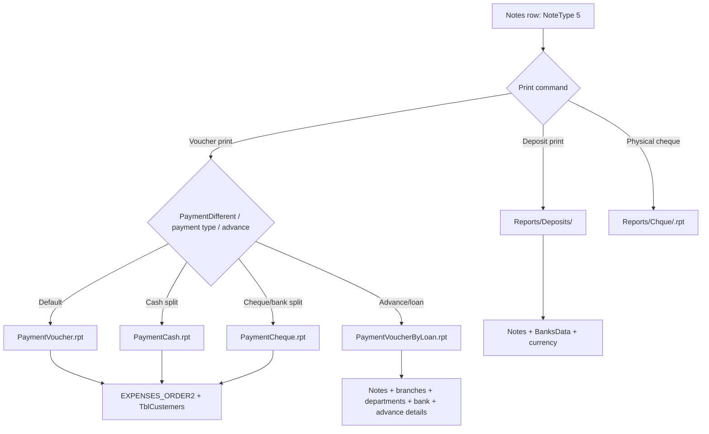

# Payment Voucher Reporting / Printing Audit

Date: 2026-05-18

Scope: سند الصرف only. Source of truth is `F:\Source Code\SatriahMain\Frm\FrmPayments.frm`; Kishny finance logic was not used.

## VB6 sections confirmed

- `Command1_Click` cases 7, 10, and 13 route payment voucher print, cheque print, and deposit print.
- `print_report` builds the normal voucher dataset and selects `PaymentVoucher.rpt`, `PaymentCash.rpt`, `PaymentCheque.rpt`, or `PaymentVoucherByLoan.rpt`.
- `print_reportDeposits` builds the deposit transfer dataset and opens `REPORTS\Deposits\<TxtReportName.Text>`.
- `print_Cheque` prints a physical bank cheque from `Reports\Chque\<report_no>.rpt`; this is separate from `PaymentCheque.rpt`.

## Report selection map

| VB6 condition | Report file | Legacy path pattern | Dataset |
| --- | --- | --- | --- |
| `SystemOptions.PaymentDifferent = False` | `PaymentVoucher.rpt` | `Special\<SystemOptions.Reportpath>\PaymentVoucher.rpt` | `EXPENSES_ORDER2 LEFT JOIN TblCustemers` |
| `PaymentDifferent = True` and `CboPaymentType.ListIndex = 0` | `PaymentCash.rpt` | `Special\<SystemOptions.Reportpath>\PaymentCash.rpt` | `EXPENSES_ORDER2 LEFT JOIN TblCustemers` |
| `PaymentDifferent = True` and payment type is not cash | `PaymentCheque.rpt` | `Special\<SystemOptions.Reportpath>\PaymentCheque.rpt` | `EXPENSES_ORDER2 LEFT JOIN TblCustemers` |
| `Option5.Value = True` (employee advance/loan) | `PaymentVoucherByLoan.rpt` | `Special\<SystemOptions.Reportpath>\PaymentVoucherByLoan.rpt` | `Notes + TblBranchesData + TblEmpDepartments + BanksData + TblEmpAdvanceDetails` |
| Deposit transfer print command | bank-specific file such as `ArabBank.rpt` | `REPORTS\Deposits\<TxtReportName.Text>` | `Notes + BanksData + currency` |
| Physical cheque print command | bank cheque design number | `Reports\Chque\<get_Cheque_report_no(BankID)>.rpt` | dummy `Expanses_Order` row plus parameters |

Report copies found in the main VB6 project include:

- `Special\Stander\PaymentVoucher.rpt`
- `Special\Stander\PaymentCash.rpt`
- `Special\Stander\PaymentCheque.rpt`
- `Special\Stander\PaymentVoucherByLoan.rpt`
- `Reports\Deposits\AlJazeeraBank.rpt`
- `Reports\Deposits\ArabBank.rpt`
- `Reports\Deposits\BSF.rpt`
- `Reports\Deposits\DevelopmentBank.rpt`
- `Reports\Deposits\NationalBank.rpt`
- `Reports\Deposits\SABB.rpt`
- `Reports\Deposits\SambaBank.rpt`
- `Reports\Deposits\SaudiBank.rpt`

## Parameter map

Normal voucher reports:

- `ParameterFields(1)` = company Arabic name.
- `ParameterFields(3)` = user name.
- `ParameterFields(4)` = branch name for English branch path.
- `ParameterFields(5)` = debit-side display text.
- `ParameterFields(6)` = customer/account code text passed by caller.
- `ParameterFields(7)` = credit-side display text.
- `ParameterFields(8)` = project Arabic name when `DCboCashType.ListIndex = 3`.
- `ParameterFields(9)` = project English name when `DCboCashType.ListIndex = 3`.
- `reporttitle`, `ApplicationName`, and `ReportAuthor` are set from VB6 title/app state.

Deposit reports:

- `ParameterFields(1)` = company Arabic name.
- `ParameterFields(3)` = user name.
- `ParameterFields(4)` = `WriteNo(XPTxtVal.Text, 0)`.
- `reporttitle` = `StrReportTitle`.

Physical cheque print:

- `ParameterFields(5..10)` = Hijri and Gregorian due-date day/month/year.
- `ParameterFields(11)` = remarks.
- `ParameterFields(12)` = cheque amount display.
- `ParameterFields(13)` = beneficiary/person text.
- `ParameterFields(14)` = amount in words caption.
- `ParameterFields(15)` = formatted due date.

## Dataset requirements

Normal report selection is by:

```sql
EXPENSES_ORDER2.NoteSerial1 = @NoteSerial1
AND EXPENSES_ORDER2.NoteType = 5
AND EXPENSES_ORDER2.NoteID = @NoteID
```

VB6 also has an older branch using `EXPENSES_ORDER2.NoteSerial = @NoteSerial` when `NoteSerial1 = 0`.

Loan report selection is by:

```sql
Notes.NoteSerial1 = @NoteSerial1
AND Notes.NoteType = 5
AND Notes.NoteID = @NoteID
```

Deposit report selection is by:

```sql
Notes.NoteType = 5
AND Notes.NoteID = @NoteID
```

## DB compatibility

| Object | Eng | Cash | Dania | Notes |
| --- | --- | --- | --- | --- |
| `Notes` | exists | exists | exists | Deposit fields are present in all three DBs. |
| `EXPENSES_ORDER2` | view exists | view exists | view exists | Normal voucher Crystal dataset source. |
| `Expanses_Order` | view exists | view exists | view exists | Used by physical cheque print as dummy source. |
| `BanksData` | exists | exists | exists | Includes `ReportName` and `IBan`. |
| `currency` | exists | exists | exists | Deposit report join source. |
| `TblCustemers` | exists | exists | exists | Normal voucher join source. |
| `TblBranchesData` | exists | exists | exists | Loan report join source. |
| `TblEmpDepartments` | exists | exists | exists | Loan report join source. |
| `TblEmpAdvanceDetails` | exists | exists | exists | Loan report detail source. |
| `projects` | exists | exists | exists | Project parameter source. |
| `usp_DynamicErpVoucher_Header` | exists | exists | missing | Dania still needs the read proc install package before full web parity. |

## Current web gaps affecting report parity

- Web print currently renders HTML views from `GetDetails`; it does not render Crystal `.rpt` files.
- The safe web save writes core `Notes` and journal fields, but does not yet capture the full deposit transfer field set required by bank deposit reports: beneficiary bank code/address/account, remitter fields, identity/address fields, beneficiary IBAN, English remarks, expenses remarks, and amount-in-words fields.
- `PaymentVoucherByLoan.rpt` requires employee advance context (`AdvanceID`, `DeptID`) and `TblEmpAdvanceDetails`; the current shared web save does not rebuild advance installment rows.
- Normal reports depend on the legacy `EXPENSES_ORDER2` view. The view exists in Eng, Cash, and Dania, but final parity still requires Crystal rendering and side-by-side output verification.
- Physical cheque print is a separate endpoint family and should not be merged with `PaymentCheque.rpt`.

## Endpoint boundaries added

- MainERP: `/MainErp/Payments/LegacyCrystalPrint/{id}`
- POS: `/Pos/Payments/LegacyCrystalPrintVoucher/{id}`

Both endpoints:

- reuse the shared `PaymentVoucherReadRepository.GetLegacyPrintProfile`;
- keep area-specific sessions and print permissions;
- return the resolved legacy report contract as JSON;
- return HTTP `501` while Crystal parity is not wired, intentionally avoiding fake PDF/report output.

## Accounting/reporting flow



## Safe modernization recommendations

- Keep the report selector as shared business logic and expose it through POS/MainERP wrappers only.
- Do not render a Crystal-equivalent document until the real `.rpt` engine or a verified report migration is wired.
- Add deposit transfer fields to the web edit/save model only after tracing the matching VB6 input controls and validation.
- Add a dedicated physical cheque print boundary separately from payment voucher print.
- For Dania, install the same read/report stored procedure package before declaring web report parity.
