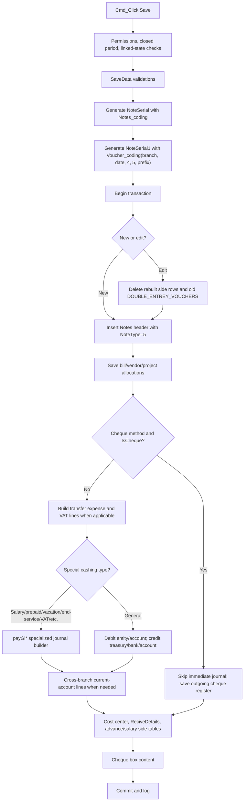
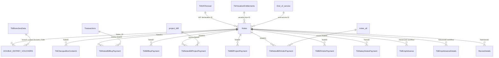

# Payment Voucher VB6 Deep Trace - سند الصرف

Date: 2026-05-18  
Scope: original VB6 payment voucher behavior before final SQL/accounting implementation.  
Business source of truth: `F:\Source Code\SatriahMain\Frm\FrmPayments.frm`.  
Rule: VB6 defines business meaning, accounting intent, field mapping, legacy workflow, and compatible output. It is not a source to copy blindly when it uses unsafe implementation patterns.

## Evidence Sources

| Source file | Procedure / section | Purpose |
| --- | --- | --- |
| `Frm\FrmPayments.frm` | `SaveData` | Main insert/edit workflow for سند الصرف. |
| `Frm\FrmPayments.frm` | `Del_Trans` | Delete/cancel cleanup workflow. |
| `Frm\FrmPayments.frm` | `Cmd_Click` | New/edit/save/delete/print permissions and guards. |
| `Frm\FrmPayments.frm` | `CboPaymentType_Change` | Payment method behavior and required treasury/bank/account controls. |
| `Frm\FrmPayments.frm` | `DCboCashType_Change` | Voucher cashing type behavior and entity/account selection. |
| `Frm\FrmPayments.frm` | `saveBillBuy`, `saveBillProject`, `saveBillVendor` | Linked invoice/installment allocation tables. |
| `Frm\FrmPayments.frm` | `saveChequeBoxContents1` | Outgoing cheque box integration. |
| `Frm\FrmPayments.frm` | `payGl`, `payGl1`, `payGlBillBuy1`, `payGl1Suppler`, `payGl8`, `payGl10`, `payGl16`, `payGl122`, `payGlVAT` | Specialized journal line builders. |
| `Bas\registry.bas` | `sand_numbering_type`, `Notes_coding`, `Voucher_coding` | Note and voucher numbering business rules. |
| `Bas\ModAccounts.bas` | `AddNewDev` | Shared DOUBLE_ENTREY_VOUCHERS row writer. |
| `Bas\Mod_DataBaseFunctions.bas` | `new_id`, `ChequeBoxOperations1` | Legacy ID generation and cheque edit/delete guard. |
| `Bas\salarY_component.bas` | `SavePaymentAndReciveDetails` | `ReciveDetails` side table rebuild. |
| `Bas\Salim.bas` | `getBranchCurrentAccount` | Branch current-account mapping for cross-branch lines. |

## Workflow Document

### 1. Command, Permission, and Lock Gates

`Cmd_Click` is the outer gatekeeper. New, edit, delete, and print operations call `DoPremis` with `Do_New`, `Do_Edit`, `Do_Delete`, or `Do_Print` against the VB6 form name. Save/delete are also blocked when the accounting period is closed by `ChekClodePeriod`.

Edit and delete have additional business gates:

| Gate | Meaning |
| --- | --- |
| `ChequeBoxOperations1(XPTxtID)` | If `SystemOptions.banks_Accounts3=True`, block editing/deleting a voucher whose outgoing cheque is already marked `Payed=1` in `TblChecqueBoxContent1`. |
| `CheAdvanced(TxtAdvance)` | Block when employee advance state disallows modification. |
| `CheAssetPayd(XPTxtID)` | Block asset-linked paid vouchers. |
| `CheckAdvanecPayed` | For employee advances, block when already paid/consumed. |
| `ChekExpensTotal` | For prepaid expenses, block delete if the expense has been extinguished/settled. |

Print checks `Do_Print`, then routes to one of the legacy report paths: normal voucher report, analytical reports for salary/subcontractor cases, GL report, cheque print, or bank deposit report.

### 2. Pre-Save Validation

`SaveData` validates required data before it opens the transaction:

| Area | VB6 behavior |
| --- | --- |
| Cashing type | `DCboCashType.ListIndex` is required. |
| Entity/person | `DBCboClientName` is required except for special cashing types 6, 7, 8, 9, 10, 11, 12. |
| Amount | `XPTxtVal` is required and numeric. |
| Payment method | `CboPaymentType.ListIndex` is required. |
| Cash payment | Method `0` requires `DcboBox` and checks available cash with `CheckBoxAccount`. |
| Cheque / post-dated cheque | Methods `1` and `3` require bank, cheque number, and due date. The due-date-in-the-past check exists but is commented in VB6. |
| Bank transfer | Method `2` requires bank and transfer number/date. |
| Account settlement | Methods `4` and `5` require `DcbAccount`. Method `5` forces supplier prepayment option (`Option3`). |
| Transfer expenses | If method `2` and transfer expenses exist, branch account index `52` must exist. |
| VAT declaration | Cashing type `12` requires branch account index `145`. |
| Linked invoice | If `ChkTrans` is enabled, invoice existence and payable amount are checked by `CheckDebitTrans`. |
| VAT on expenses/prepaid | VAT account existence is checked through `GetValueAddedAccount` / branch account validation before saving. |

### 3. Numbering

Payment vouchers use two independent serials:

| Field | VB6 source | Meaning |
| --- | --- | --- |
| `Notes.NoteType` | Constant `5` | Payment voucher / سند الصرف. |
| `Notes.NoteSerial` | `Notes_coding(my_branch, XPDtbTrans.Value)` | General journal note serial. |
| `Notes.NoteSerial1` | `Voucher_coding(my_branch, XPDtbTrans.Value, 4, 5, , , DCPreFix.Text)` | Payment voucher document serial. |
| `Notes.Prefix` | `DCPreFix.Text` | Voucher prefix, commonly payment-method dependent in existing data. |
| `Notes.sanad_year`, `Notes.sanad_month` | transaction date | Period tags stored on the voucher. |
| `numbering_type`, `numbering_type1` | `sand_numbering_type(0)` and `sand_numbering_type(4)` | Saved numbering mode snapshots. |

`Notes_coding` and `Voucher_coding` can return:

| Return | Meaning |
| --- | --- |
| `"error"` | The configured numbering range has been exceeded. Save must be blocked. |
| empty string | Manual numbering is configured. Save must be blocked or routed to a manual-numbering workflow. |
| serial value | Save continues with that exact value. |

Modern implementation must preserve the numbering shape and scope from VB6, but must not preserve the unsafe `MAX+1` race behavior. Serial allocation needs transaction-safe locking around the same scope used by `Notes_coding` / `Voucher_coding`: branch, date period, voucher type, note type, and prefix/store/user options where enabled.

### 4. Notes Insert / Update

`SaveData` starts `Cn.BeginTrans` after validation and numbering.

| Mode | VB6 behavior |
| --- | --- |
| New (`TxtModFlg="N"`) | Allocates `NoteID` by `new_id("Notes", "NoteID", "", True)`, opens `Notes`, `AddNew`, sets `NoteID`. |
| Edit (`TxtModFlg="E"`) | Reuses existing `NoteID`, deletes existing `DOUBLE_ENTREY_VOUCHERS where Notes_ID = XPTxtID`, deletes salary/payment/temp/advance detail records that are rebuilt later. |

Important header fields saved to `Notes`:

| Group | Fields |
| --- | --- |
| Identity | `NoteID`, `NoteType=5`, `NoteSerial`, `NoteSerial1`, `OldNoteSerial1`, `Prefix`, `ManualNO` / `ManulaNO`, `Order_no`, `Transaction_ID`. |
| Dates and period | `NoteDate`, `NoteDateH`, `sanad_year`, `sanad_month`. |
| Amounts | `Note_Value`, `Note_ValueE`, `Rate`, `CurrncyID`, `TotalNotesValue`, `VAT`, `IncludVAT`, `PreVAT`, `note_value_by_characters`. |
| Text | `Remark`, `general_des_notes`, `person`. |
| Ownership | `branch_no`, `UserID`, `general_cost_center`, `foxy_no`. |
| Entity mapping | `CusID`, `EmpAccountCode`, `BTCashAccountcode`, `ProjectMainID`, depending on `DCboCashType.ListIndex`. |
| Payment method | `NoteCashingType`, `BoxID`, `BankID`, `ChqueNum`, `DueDate`, `ChequeBoxID`. |
| Project/cost | `ProjectID`, `Pand`, `Oper`, `DeptID`. |
| Special workflow fields | Salary, advance, end-service, prepaid, vacation, VAT declaration, and related IDs are set per cashing type. |

Entity mapping by cashing type:

| Cashing type | VB6 intent |
| --- | --- |
| `0` | Customer / general receivable-style entity. |
| `1` | Supplier/vendor payment. |
| `2` | Person / subcontractor-like entity. |
| `3` | Project main account; stores `ProjectMainID`. |
| `4` | Employee account; stores `EmpAccountCode`, clears `CusID`, sets `person`. |
| `5` / `6` | Direct account / salary account style; stores `BTCashAccountcode`, clears `CusID`. |
| `7` | Prepaid expenses. |
| `8` | Vacation entitlements. |
| `9` | Contractor/subsupplier attribution payments. |
| `10` | End of service. |
| `11` | Annual component / approved payments. |
| `12` | VAT declaration payment. |
| `13` / `14` | Supplier/person variants related to acceptance/LC period behavior. |

Payment method mapping:

| Method | VB6 intent | `Notes` fields |
| --- | --- | --- |
| `0` | Cash box | `BoxID`, `BankID=NULL`, `ChqueNum=NULL`, `DueDate=NULL`, `NoteCashingType=0`. |
| `1` | Cheque | `BankID`, `ChqueNum`, `DueDate`, `BoxID=NULL`, `NoteCashingType=1`. |
| `2` | Bank transfer | `BankID`, transfer number/date in cheque fields, `ChequeBoxID=NULL`, `NoteCashingType=2`. |
| `3` | Post-dated cheque / cheque variant | Same bank/cheque/date structure, `NoteCashingType=3`. |
| `4` | Account settlement | `NoteCashingType=4`, account selected in `DcbAccount`. |
| `5` | Supplier prepayment/account settlement | `NoteCashingType=5`, account selected, `Option3=True`. |

### 5. Linked Payment Tables

The voucher can allocate payment to several legacy tables before final `Notes.Update`.

| Procedure | Delete-on-edit | Inserts / updates |
| --- | --- | --- |
| `saveBillBuy` | `TblNotesBillBuyPayment where NoteID1=XPTxtID`; `TblBillBuyPayment where TypTrans IS NULL and NoteID=XPTxtID` | Inserts selected purchase bill rows into `TblNotesBillBuyPayment`, updates `Transactions.TotalPayed`, inserts `TblBillBuyPayment`. |
| `saveBillProject` | `TblNotesBillProjectPayment`; `TblBillProjectPayment` | Inserts selected project bill rows, updates `project_billl.TotalPayed`, inserts `TblBillProjectPayment`. |
| `saveBillVendor` | `TblNotesBillVindorPayment`; `TblBillVindorPayment` | Inserts installment/vendor rows, updates `TblQestFexed`, `notes_all.FlgPaye`, `notes_all.TotalPayed`, inserts `TblBillVindorPayment`. |
| `SavePaymentAndReciveDetails(0, ...)` | `ReciveDetails where NoteSerial1=...` | Recreates `ReciveDetails` payment side record with customer, box/bank/cheque, value, description, and date. |
| `saveChequeBoxContents1` | `TblChecqueBoxContent1 where NoteID=...` | Recreates outgoing cheque box record when cheque-box mode applies. |

### 6. Accounting Journal Generation

Journal rows are written to `DOUBLE_ENTREY_VOUCHERS`. On edit, VB6 deletes old rows by `Notes_ID` and rebuilds them. `AddNewDev` is the common row writer and sets core fields including:

`Double_Entry_Vouchers_ID`, `DEV_ID_Line_No`, `Account_Code`, `Value`, `Credit_Or_Debit`, `Double_Entry_Vouchers_Description`, `Notes_ID`, `RecordDate`, `RecordDateH`, `UserID`, `Account_Interval_ID`, `currency`, `rate`, `branch_id`, project/pand/oper/dept, optional `BankID`, `BoxID`, `EmpID`, `CusID`, and optional related-entity metadata.

Credit/debit convention from VB6:

| Value | Meaning |
| --- | --- |
| `Credit_Or_Debit = 0` | Debit line. |
| `Credit_Or_Debit = 1` | Credit line. |

Main flow:

1. If `SystemOptions.IsCheque=True` and payment method `1`, VB6 skips immediate `DOUBLE_ENTREY_VOUCHERS` creation and only saves cheque-box content later.
2. If transfer expenses exist for methods `2`, `4`, or `5`, VB6 adds expense debit, optional VAT debit, and matching credit lines before the main payment lines.
3. If prepaid/VAT amount `TxtPrePayd(17)>0` applies, VB6 adds VAT debit line `1003`.
4. Special cashing types delegate journal detail to `payGl*` helpers.
5. Otherwise VB6 creates the general two-sided payment entry:
   - Debit selected/entity account (`DcboDebitSide` or supplier prepayment account when `Option3=True`).
   - Credit payment source account (`DcboCreditSide`), which is the cashbox, bank, or selected account side.
6. Cross-branch current-account balancing lines are added for customer/supplier/employee cases when voucher branch differs from entity branch and `DontDistributeLegalACC=False`.

Special journal paths:

| Cashing type / condition | Procedure | Accounting intent |
| --- | --- | --- |
| `12` | `payGlVAT` | Pay VAT declaration: debit VAT declaration account, credit payment source. |
| `6` | `payGl` | Salary payment lines from salary grid, cost-center rows, salary paid flags. |
| `7` | `payGl122` | Prepaid expense payment lines from prepaid expense details. |
| `8` | `payGl8` | Vacation entitlement payment; blocks negative computed values. |
| `9` | `payGl1Suppler` | Contractor/subsupplier attribution installments. |
| `10` | `payGl10` | End-of-service payment, multiple employee entitlement/discount/advance lines. |
| `11` | `payGl16` | Annual component / approved payment rows. |
| Type `1` plus financial invoice grid | `payGl1` | Supplier/customer financial invoice partial payments. |
| Type `1` plus purchase bill grid | `payGlBillBuy1` | Purchase bill partial payments. |

Transfer expenses and VAT:

| Line | Debit/Credit | Account source | Value |
| --- | --- | --- | --- |
| `10000` | Debit | Bank commission branch account index `52` for method `2`, otherwise selected debit expense account | Transfer expense net value. |
| `10001` | Debit | VAT account from `GetValueAddedAccount(..., 23)` | VAT part when included and percentage > 0. |
| `10002` | Credit | `DcboCreditSide` | Transfer expense plus VAT amount. |
| `1003` | Debit | VAT account from `GetValueAddedAccount(..., 23)` | `TxtPrePayd(17)` where applicable. |

Cross-branch balancing:

`getBranchCurrentAccount` reads `TblBranchesData.Account_Code`. VB6 creates paired current-account lines when payment branch and entity branch differ. Modern SQL must preserve balance, account direction, branch assignment, and line linkage, but should compute it deterministically rather than from UI-side line counters.

### 7. End-Save Side Effects

After `Notes.Update` and journal generation, `SaveData` performs additional side effects inside the transaction:

| Side effect | Purpose |
| --- | --- |
| `save_General_cost_center`, `save_cost_center` | Cost center distribution. |
| `updateNotesValueAndNobytext` | Refresh amount text and possibly normalized note value fields. |
| `SavePaymentAndReciveDetails(0, TxtNoteSerial, txtNoteSerial1, txt_ORDER_NO, XPDtbTrans.Value)` | Rebuild `ReciveDetails`. |
| `TblEmpAdvanceDetails` delete + `saveAdvancedData` | Rebuild employee advance detail rows. |
| `FIFO_FUNCTION` / `Distribute_to_bills` | Optional customer/vendor bill allocation logic. |
| `TblVocationEntitlements.PayedPayment=1` | Mark vacation entitlement paid for type `8`. |
| `TblEmpAdvanceRequest.AccAproved=1` | Mark employee advance approved/paid when applicable. |
| `SaveSalaryPyment` | Salary payment side table for type `6`. |
| `saveChequeBoxContents1(XPTxtID)` | Outgoing cheque register content. |
| `CuurentLogdata` | Audit/history log. |

### 8. Delete / Cancel Cleanup

`Del_Trans` is transactional cleanup plus the `Notes` delete. It blocks paid cheque-box and asset-linked cases first.

Confirmed cleanup targets:

| Table / procedure | Cleanup behavior |
| --- | --- |
| `TblPripaidExpensesDet` | Resets `PaymentPayed=0` for prepaid detail IDs in `PayDes`. |
| `DeletePayedSalary` | Salary payment cleanup. |
| `DeletePayedPayment`, `DeletePayedPayment2`, `DeletePayedPaymeQest` | Prepaid/subsupplier/installment payment cleanup. |
| `TblVocationEntitlements` | Sets `PayedPayment=NULL` for type `8`. |
| `TblVATAvowal` | Sets `Paid=NULL` for type `12`. |
| `Notes` | Deletes the voucher header through `rs.Delete`. |
| `TblEmpAdvanceRequest` | Clears `AccAproved`. |
| `TblSalaryNotesPayment` | Deletes by `TransID=XPTxtID`. |
| `marakes_taklefa_temp` | Deletes by `kedno=Text1`. |
| `ReciveDetails` | Deletes by `NoteSerial1=txtNoteSerial1`. |
| `TblChecqueBoxContent1` | Deletes by `NoteID=XPTxtID`. |
| `TblEmpAdvance`, `TblEmpAdvanceDetails` | Deletes by advance ID. |
| `End_of_service` | Clears `PaymPaid` for type `10`. |
| `DeleteBill`, `DeleteBillBuy`, `DeleteBillProject` | Reset bill/project/purchase payment totals. |
| `TblNotesBillProjectPayment`, `TblBillProjectPayment` | Delete project bill allocations. |
| `TblNotesBillVindorPayment`, `TblBillVindorPayment` | Delete vendor/installment allocations. |
| `TblNotesBillBuyPayment`, `TblBillBuyPayment` | Delete purchase bill allocations. |

Important trace finding: `Del_Trans` does not visibly issue `DELETE FROM DOUBLE_ENTREY_VOUCHERS WHERE Notes_ID = XPTxtID` in the inspected section. This may rely on database triggers/cascade, or it may be a legacy omission. Modern delete must not leave orphan journal rows; it should explicitly delete or reverse voucher journal rows inside the same transaction after confirming whether any trigger already exists.

## Accounting Flow Diagram

## Table Relationship Map

Core relationship rules:

| Parent / key | Related rows |
| --- | --- |
| `Notes.NoteID` | Journal rows (`DOUBLE_ENTREY_VOUCHERS.Notes_ID`), cheque rows, allocation rows, salary/advance rows. |
| `Notes.NoteSerial1` | `ReciveDetails.NoteSerial1`, user-visible voucher serial, report link. |
| `Notes.NoteSerial` | General journal note serial. |
| `Notes.NoteType=5` | Identifies payment vouchers for reports and numbering. |
| `Notes.Prefix` | Participates in voucher serial scope for payment-method/prefix numbering. |
| Source bill IDs | Allocation tables point back to `Transactions`, `project_billl`, `notes_all`, `TblQestFexed`, etc. and update paid totals/flags. |

## Safe To Modernize Recommendations

1. Preserve `NoteType=5`, `NoteSerial`, `NoteSerial1`, prefix, branch, date period, cashing type, payment method, entity mapping, and report-compatible fields.
2. Replace VB6 `new_id` / `MAX+1` allocation with transaction-safe SQL Server 2012-compatible locking. Use the same business scope as `Notes_coding` and `Voucher_coding`, but protect it with `UPDLOCK/HOLDLOCK`, a counter table, or `sp_getapplock`.
3. Compute serials once per save attempt. Do not copy VB6 repeated serial function calls if a modern implementation has side effects.
4. Rebuild journal rows atomically on edit: delete existing `DOUBLE_ENTREY_VOUCHERS` for `Notes_ID`, rebuild every applicable line, validate balanced debit/credit total, then commit.
5. Explicitly clean journal rows on delete or reversal. Do not rely on `rs.Delete` side effects unless database triggers are inspected and proven.
6. Split payment voucher save into clear server-side cases: general voucher, cheque-deferred voucher, bank transfer with expenses, supplier prepayment, VAT declaration, salary, prepaid expense, vacation, end-of-service, annual component, and linked invoice/bill allocations.
7. Block unsupported cases server-side with Arabic messages until all required inputs and allocation payloads exist. This is safer than writing incomplete journals.
8. Preserve VAT and transfer-expense accounting intent, including VAT account lookup and bank commission account index `52`, but fail fast if accounts are missing.
9. Preserve branch current-account balancing, using `TblBranchesData.Account_Code`, but make line ordering and branch assignment deterministic.
10. Use parameterized stored procedures and typed payloads. Do not migrate VB6 string-concatenated SQL or UI-grid state dependencies.
11. Store Arabic descriptions and notes in Unicode-safe fields/parameters. The web UI should show `Account_Serial` and `Account_Name`, not internal `Account_Code`.
12. Keep all side table cleanup inside the same transaction as the voucher save/delete.
13. Add a post-build accounting assertion: voucher journal debits equal credits, no orphan journal rows, no duplicate `NoteSerial1` in the scoped numbering range, and every rebuilt allocation has a matching source update.
14. Make intentional deviations explicit in SQL comments/docs when they harden VB6 weaknesses.

## Intentional Deviations From VB6

| VB6 pattern | Modern behavior |
| --- | --- |
| `new_id` uses `MAX+1` over tables. | Use concurrency-safe allocation. This preserves serial meaning while fixing duplication risk. |
| `Del_Trans` does not visibly delete `DOUBLE_ENTREY_VOUCHERS`. | Explicitly delete/reverse journal rows in the voucher delete transaction unless DB triggers prove this is redundant. |
| Due-date-past validation for cheques is commented out. | Decide and enforce the production rule explicitly; do not silently inherit a commented-out check. |
| UI grid state drives allocation save. | Accept structured allocation rows server-side and validate totals/accounts independently. |
| Many SQL statements are string concatenations. | Use parameterized SQL/stored procedures. |
| `On Error` / partial cleanup patterns can hide failures. | Fail atomically and rollback on any save/delete error. |
| Monolithic `SaveData`. | Keep shared business rules in a service/procedure layer with clear case-specific branches. |

## Remaining Confirmation Before Final SQL

| Question | Why it matters |
| --- | --- |
| Are there triggers/cascades on `Notes` that delete `DOUBLE_ENTREY_VOUCHERS`? | Determines whether explicit journal delete is a compatibility addition or duplicate cleanup. |
| Which payment prefixes are active per DB and payment method? | `Voucher_coding(..., DCPreFix.Text)` depends on prefix scope. |
| What are `SystemOptions.IsCheque` and `banks_Accounts3` in Eng/Cash/Dania? | Cheque method may skip immediate journal and enforce cheque-box edit/delete guards. |
| Does the web payload include transfer expenses, VAT inclusion, allocation grids, employee/prepaid/salary/end-service fields? | Missing data should block those cases rather than saving fake accounting. |
| Are all branch account indexes (`52`, `145`, VAT index `23`) configured in target DBs? | Missing accounts must block save with a clear Arabic message. |
| Are `SavePaymentAndReciveDetails`, cost-center saves, and `AddNewDev` required fields fully represented in SQL procedures? | Needed for report compatibility and no orphan side effects. |

## Implementation Boundary

This trace document does not implement SQL changes. Final SQL work should begin only after mapping each intended supported case to a verified payload and database object set for Eng, Cash, and Dania.
