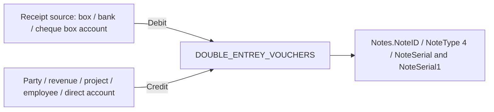

# Receipt Voucher / سند القبض VB6 Audit

Date: 2026-05-18  
Scope: Start receipt voucher work by reusing the hardened shared finance architecture from payment voucher, without duplicating accounting logic or inventing receipt behavior.  
Source of truth: `F:\Source Code\SatriahMain` only. Kishny was not used for finance/accounting logic.

## Executive status

Receipt voucher is already partly wired in both POS and MainERP, but it is not production-ready. The current web controllers route receipt saves through the shared `PaymentVoucherWriteRepository` and `dbo.usp_DynamicErpVoucher_Save`. The current hardened payment SQL blocks `@noteType <> 5`, while the older generic SQL used unsafe `MAX + 1` numbering and simplified two-line journal logic. Therefore receipt write tests must remain blocked until a receipt-specific, VB6-equivalent save/accounting implementation is completed safely.

This document is the first checkpoint for the receipt track: VB6 source confirmation, current web route audit, accounting/numbering trace, linked-table map, print/report mapping, and modernization recommendations.

## VB6 source files confirmed

| Purpose | File | Confirmation |
| --- | --- | --- |
| General Receipt Voucher / سند القبض source | `F:\Source Code\SatriahMain\Frm\FrmCashing1.frm` | Confirmed by deep trace of `SaveData`, `SaveJL`, `saveChequeBoxContents`, `Del_Trans`, and `print_report`. |
| Alternate/legacy cashing form | `F:\Source Code\SatriahMain\Frm\FrmCashing.frm` | Exists, but the deep accounting workflow for the current receipt voucher is in `FrmCashing1.frm`. |
| Specialized receipt/installment screen | References such as `FrmReceiptPart` from main modules | Separate flow; must not be merged into general receipt voucher without a dedicated trace. |
| Receipt report | `F:\Source Code\SatriahMain\Reports\REPORTS NEW\Expenses_order10.rpt` | Used directly by `FrmCashing1.print_report`. |

## Current web implementation audit

| Screen | POS route | MainERP route | Controller | View | Save endpoint | Print endpoint | Permission key | Status | Gaps |
| --- | --- | --- | --- | --- | --- | --- | --- | --- | --- |
| سند قبض list/details | `/Pos/Cashing/Index`, `/Pos/Cashing/Details/{id}` | `/MainErp/Cashing/Index`, `/MainErp/Cashing/Details/{id}` | `Areas/Pos/Controllers/CashingController.cs`, `Areas/MainErp/Controllers/CashingController.cs` | `Areas/Pos/Views/Cashing/*.cshtml`, `Areas/MainErp/Views/Cashing/*.cshtml` | n/a | n/a | `FrmCashing` | Partly shared read architecture | Route names are legacy `Cashing`, not the suggested `/Finance/ReceiptVoucher`; acceptable until a compatibility route is added. |
| سند قبض create/edit/save | `/Pos/Cashing/Create`, `/Pos/Cashing/Edit/{id}`, `/Pos/Cashing/Save` | `/MainErp/Cashing/Create`, `/MainErp/Cashing/Edit/{id}`, `/MainErp/Cashing/Save` | Same as above | POS/MainERP wrapper views use payment edit view wrappers: `Areas/*/Views/Payments/Edit.cshtml` | `CashingController.Save` sets `NoteType = 4` then calls `PaymentVoucherWriteRepository.Save` | n/a | `FrmCashing` | Not production-ready | Shared write repository currently represents payment voucher semantics. SQL blocks receipt in hardened payment script, or older script uses unsafe numbering/fake journal. |
| سند قبض post/delete | `/Pos/Cashing/Post`, `/Pos/Cashing/Delete` | `/MainErp/Cashing/Post`, `/MainErp/Cashing/Delete` | Same as above | Details views contain post/delete forms | `PaymentVoucherWriteRepository.Post/Delete(4, ...)` | n/a | `FrmCashing` | Not production-ready | Delete cleanup is not VB6-equivalent for receipt linked tables. Lock/posted/cheque movement checks need receipt-specific rules. |
| سند قبض print | `/Pos/Cashing/Print/{id}` | `/MainErp/Cashing/Print/{id}` | Same as above | `Areas/*/Views/Payments/Print.cshtml` | n/a | `CashingController.Print` | `FrmCashing` | Placeholder preview only | VB6 Crystal report is `Expenses_order10.rpt`; web endpoint does not yet reproduce dataset/parameters/report design. |

## VB6 workflow trace

### Save entry point

Procedure: `FrmCashing1.frm::SaveData` around line `14526`.

Important validated behavior:

- Uses `NoteType = 4` for general receipt vouchers.
- Validates receipt category (`DCboCashType`) and required party/project/employee/account/contract fields depending on receipt category.
- Uses branch from `Dcbranch.BoundText`.
- Persists the receipt in `Notes`.
- Deletes/rebuilds old `DOUBLE_ENTREY_VOUCHERS` on edit.
- Rebuilds cheque-box contents through `saveChequeBoxContents`.
- Rebuilds linked receipt tables for property/project/installment-style flows.
- Calls `SaveJL` only when accounting is enabled (`SystemOptions.SysAppAccoutingType = CompeleteAccounting`), except for special rent-contract options that call alternate journal routines.

### Numbering

VB6 behavior:

- `NoteSerial` comes from `Notes_coding(Val(my_branch), XPDtbTrans.Value)`.
- `NoteSerial1` comes from `Voucher_coding(Val(my_branch), XPDtbTrans.Value, 2, 4)`.
- `NoteType = 4`.

Business meaning:

- Receipt voucher uses voucher coding category `2`, not the payment voucher category `4`.
- `NoteSerial` and `NoteSerial1` are separate numbers and must not be generated by generic `MAX + 1`.
- Modern SQL must preserve the same branch/date/prefix scope used by legacy coding while protecting concurrency with transaction locks or a compatible counter service.

Modernization rule:

- Do not copy VB6 `new_id`/scan patterns. Implement concurrency-safe numbering with SQL Server 2012-compatible locks and verified scope.

### Notes insert/update map

`SaveData` writes or updates `Notes` with many fields. Confirmed high-value fields include:

- Identity/numbering: `NoteID`, `NoteType`, `NoteSerial`, `NoteSerial1`, `OldNoteSerial1`, `sanad_year`, `sanad_month`.
- Dates: `NoteDate`, `NoteDateH`, period dates and Hijri period dates.
- Organization: `branch_no`, `EmpId`, `foxy_no`, `general_cost_center`, `CarId`, `DriverId`, `UserID` through journal lines.
- Amounts: `Note_Value`, `Note_Value2`, `Adv_payment_value`, `RemaiValue`, `VAT`, `commission`, `CommissionOut`, `rent`, `Water`, `Electricity`, `Instrunce`, `Servce`, `Telephone`, `comX`, `ComY`.
- Accounts: `DebitSide`, `CreditSide`, `AccountPaym`, `AccountsCode`.
- Payment method: `NoteCashingType`, `BoxID`, `BankID`, `ChequeBoxID`, `ChqueNum`, `DueDate`, `BankName`.
- Parties/links: `CusID`, `project_id`, `EmployeeID`, `Transaction_ID`, `MaintananceID`, `RevenuesID`, `ContractNo`, `ContNo`, `FilterID`, `akarid`, `UnitType`, `UnitNo`.
- Text: `person`, `Remark`, manual/book numbers, `note_value_by_characters`.

### Receipt category / person handling

Observed `DCboCashType.ListIndex` branches:

| Index | Legacy meaning observed | Required selection/link behavior |
| --- | --- | --- |
| 0, 1, 2 | Customer/vendor style receipts | Requires `DBCboClientName`; saves `CusID`; cheque-box customer account fields can be derived for type 0. |
| 3 | Other revenues | Requires `DcboRevenuesTypes`; saves `RevenuesID`. |
| 4 | Customer/person-linked receipt | Saves `CusID`. |
| 5 | Project receipt | Requires project selection; saves `project_id`, `note_count`, project customer/subcontractor account context. |
| 6 | Employee receipt | Requires `DCEmployee`; saves `EmployeeID`. |
| 7 | Direct account receipt | Requires `DCAccounts`; saves `AccountsCode`; print query joins `ACCOUNTS`. |
| 8 | Rent/contract receipt | Requires contract; links `ContractNo`, `ContNo`, installment/property fields; has complex alternate journal paths. |
| 9 | Earnest/property receipt | Requires property fields; writes `TblAqrEarnest` and property journal details. |
| 10 | Filter/settlement receipt | Saves `FilterID`, `FIlterTotal`, `TotalInsurances`; has special no-journal-in-contract branches. |
| 11, 12 | Customer-linked receipt categories | Saves `CusID`; accounting details need further isolated trace. |
| 13 | Other property expense/utility settlement | Requires settlement/electricity reference; updates `TblOtheExpensAqar.FlgPayed`. |

The first production SQL pass should support only the receipt categories whose accounting has been fully mapped. Unmapped categories must be blocked with clear Arabic messages instead of saved with a fake journal.

### Payment method handling

VB6 `CboPayMentType.ListIndex` maps:

| Index | Meaning | Notes fields |
| --- | --- | --- |
| 0 | Cash/box | `NoteCashingType = 0`, set `BoxID`, clear bank/cheque/due fields. |
| 1 | Cheque-box or bank cheque depending `SystemOptions.ChequeBox` | `NoteCashingType = 1`; if cheque box is disabled, set `BankID`; if enabled, set `ChequeBoxID`; set `ChqueNum` and `DueDate`. |
| 2 | Bank/check style payment | `NoteCashingType = 2`, set `BankID`, cheque number and due date. |
| 3 | Bank transfer/deposit style | `NoteCashingType = 3`, set `BankID`, cheque number and due date. |
| 4 | No box/bank source | `NoteCashingType = 4`; no `BoxID`. |

The current shared web validation requires exactly one of box or bank, which does not cover every receipt method above, especially cheque-box behavior.

### Cheque handling

Procedure: `FrmCashing1.frm::saveChequeBoxContents` around line `17082`.

Behavior:

- Deletes existing `TblChecqueBoxContent` rows for `NoteID`.
- Exits if no `DcChequeBox`.
- Inserts one cheque-box row with:
  - `NoteID`, `ChequeBoxID`, `RecordDate`, `DueDate`, `BankName`, `ChequeNo`, `ChequeValue`.
  - `Remarks = DcboCreditSide.Text`.
  - `Deposited = 0`, `Collected = 0`.
  - `CreditAccount = DcboCreditSide.BoundText`.
  - Customer/project account snapshots for selected categories.

Modernization requirement:

- Rebuild this table inside the same transaction as `Notes` and `DOUBLE_ENTREY_VOUCHERS`.
- Block delete if deposited/collected cheque-box operations exist; VB6 contains commented checks, but production web must harden this safely.

### Journal behavior

Procedure: `FrmCashing1.frm::SaveJL` around line `15755`.

Simple receipt accounting intent:

General pattern confirmed in `SaveJL`:

- First journal line is debit side:
  - `Account_Code = DcboDebitSide.BoundText`.
  - `Value = XPTxtVal + TxtVATValue`.
  - `Credit_Or_Debit = 0`.
- Credit line usually uses:
  - `Account_Code = DcboCreditSide.BoundText`.
  - `Value = XPTxtVal`.
  - `Credit_Or_Debit = 1`.
- VAT, rent, property, owner, commission, and special contract cases add more lines and can redirect the credit account.
- Every line links `Notes_ID = XPTxtID`, `RecordDate`, `RecordDateH`, `UserID`, `branch_id`, and `Account_Interval_ID`.

Modernization requirement:

- Do not use a generic inverted payment two-line journal for all receipt cases.
- Do not fake balance by adding an unexplained line.
- Implement each supported case as explicit journal-line builders with a final debit/credit balance assertion.
- For complex rent/property/project categories, block save until their VAT/commission/owner/account behavior is fully traced and tested.

### Edit rebuild behavior

Observed in `SaveData`:

- On edit, old `DOUBLE_ENTREY_VOUCHERS` rows for the receipt `NoteID` are deleted before journal rebuild.
- Several linked tables are deleted/rebuilt depending on category.
- `NoteSerial1` may be regenerated or retained according to legacy mode flags and coding validation; this must be verified against live data before enabling edit for every category.

Modernization requirement:

- Edit must be one transaction:
  - Lock receipt row.
  - Validate not posted/locked/externally linked.
  - Delete/rebuild journal and owned link rows.
  - Preserve immutable serials unless VB6 intent explicitly requires regeneration for that operation.

### Delete/cancel cleanup

Procedure: `FrmCashing1.frm::Del_Trans` around line `17379`.

Confirmed cleanup targets:

- `TblUnitNoInformation`
- `TblAqarCommissions`
- `marakes_taklefa_temp`
- `ReciveDetails` by `NoteSerial1`
- `TblAqrEarnest`
- `ProjectBillBuy` by `TxtNoteSerial`
- `TblOtheExpensAqar` reset `FlgPayed = NULL` for category 13
- `ContracttBillInstallmentsDone`
- `TblChecqueBoxContent`
- `TblNotesSales`
- `Notes` row deleted through the bound recordset

Modernization requirement:

- Delete must be inside a database transaction.
- Delete must block posted/locked rows and cheque-box rows already deposited/collected.
- Delete must clean only rows owned by the voucher and must not remove unrelated rows by ambiguous serial text without verified scoping.

## Linked table map

| Table | Relationship | VB6 behavior | Web status |
| --- | --- | --- | --- |
| `Notes` | Header and core voucher data | Insert/update/delete receipt `NoteType = 4` | Read exists; write not receipt-safe. |
| `DOUBLE_ENTREY_VOUCHERS` | Journal lines | Delete/rebuild on edit; delete on voucher delete | Payment-oriented procedure exists; receipt equivalent pending. |
| `TblChecqueBoxContent` | Receipt cheque-box content | Delete/reinsert by `NoteID`; blocks should be hardened if deposited/collected | Not covered by current shared save. |
| `ReciveDetails` | Receipt/bill allocation detail | Deleted by `NoteSerial1` in delete flow | Not covered safely yet. |
| `ContracttBillInstallmentsDone` | Rent/contract installment receipts | Joined in print and deleted by `NoteID` | Must be treated as complex linked allocation, not simple voucher. |
| `TblNotesSales` | Salesperson/commission allocations | Deleted by `NoteID` | Needs dedicated rebuild trace. |
| `TblAqrEarnest` | Property earnest receipts | Deleted by `NoteID`/legacy temp id | Needs property-specific trace. |
| `TblAqarCommissions` | Property commissions | Deleted by `NoteID` | Needs property-specific trace. |
| `TblUnitNoInformation` | Unit/property linkage | Deleted by `NoteID` | Needs property-specific trace. |
| `ProjectBillBuy` | Project payment/receipt link by serial | Deleted by `TxtNoteSerial` | Must be scoped safely before implementation. |
| `TblOtheExpensAqar` | Other property expense settlement | `FlgPayed` reset on category 13 delete | Needs exact update/rebuild trace. |

## Report mapping

Procedure: `FrmCashing1.frm::print_report` around line `9062`.

VB6 report:

- `F:\Source Code\SatriahMain\Reports\REPORTS NEW\Expenses_order10.rpt`

Dataset:

- Main table `Notes`.
- Joins include `ContracttBillInstallmentsDone`, `BanksData`, `TblAkarUnit`, `TblAqar`, `TblAqarDetai`, `TblBranchesData`, `TblCustemers`, `TblContract`.
- If `DCboCashType.ListIndex = 7`, joins `ACCOUNTS` and uses account name as customer/person name.
- Filter: current `Notes.NoteID = XPTxtID`.

Important fields in report query:

- Header: `NoteID`, `NoteDate`, `NoteType`, `NoteSerial`, `NoteSerial1`, `Note_Value`, `Note_Value2`, `NoteDateH`, `branch_no`.
- Payment: `NoteCashingType`, `BankName`, `BankID`, `DueDate`, `ChqueNum`.
- Party/property: `CashingType`, `CusID`, customer names/phones, renter, contract, property/unit fields.
- Amount breakdown: `VAT`, `commission`, `rent`, `Water`, `Electricity`, `Instrunce`, `Servce`, `CommissionOut`, `Telephone`, `RemaiValue`, installment paid fields.

Parameters observed:

- Company Arabic name.
- User name.
- Amount in words using `WriteNo(XPTxtVal + TxtVATValue, 0, True, ".")`.
- Remaining value caption.
- Report title-like label: `"سند " & CboPayMentType.Text`.

Web print boundary:

- Existing `/Pos/Cashing/Print/{id}` and `/MainErp/Cashing/Print/{id}` can remain as route boundaries.
- They must not pretend to be Crystal parity until the dataset and report renderer/export path are completed.

## Database compatibility snapshot

Objects inspected on allowed databases `Eng`, `Cash`, `Dania`.

| Object | Eng | Cash | Dania | Note |
| --- | --- | --- | --- | --- |
| `Notes` | Exists | Exists | Exists | Receipt rows present. |
| `DOUBLE_ENTREY_VOUCHERS` | Exists | Exists | Exists | Receipt journal target. |
| `TblChecqueBoxContent` | Exists | Exists | Exists | VB6 receipt cheque table. |
| `TblChecqueBoxContent1` | Exists | Exists | Exists | Payment cheque table; do not confuse with receipt cheque-box flow. |
| `ReciveDetails` | Exists | Exists | Exists | Receipt allocation cleanup target. |
| `TblNotesSales` | Exists | Exists | Exists | Receipt salesperson/commission linkage. |
| `ContracttBillInstallmentsDone` | Exists | Exists | Exists | Rent/contract receipt allocation. |
| `TblAqrEarnest` | Exists | Exists | Exists | Property earnest linkage. |
| `TblAqarCommissions` | Exists | Exists | Exists | Property commission linkage. |
| `TblUnitNoInformation` | Exists | Exists | Exists | Property/unit linkage. |
| `ProjectBillBuy` | Exists | Exists | Exists | Project bill link by receipt serial. |
| `TblOtheExpensAqar` | Exists | Exists | Exists | Category 13 flag reset. |
| `usp_DynamicErpVoucher_Save` | Exists | Exists | Exists | Current installed shape must be verified before receipt writes. |
| `usp_DynamicErpVoucher_Header` | Exists | Exists | Missing | Dania read/print compatibility gap. |

Receipt row counts observed:

| Database | `Notes.NoteType = 4` | `Notes.NoteType = 5` |
| --- | ---: | ---: |
| Eng | 322 | 6162 |
| Cash | 16 | 720 |
| Dania | 4217 | 13762 |

## Current blockers before SQL implementation

1. Shared save path is payment-oriented.
   - `CashingController.Save` in both POS and MainERP sets `NoteType = 4` and calls `PaymentVoucherWriteRepository.Save`.
   - Hardened payment SQL currently blocks non-payment voucher saves.
   - Older generic SQL allowed `NoteType = 4` but used unsafe `MAX + 1` and fake two-line accounting.

2. Receipt accounting is not a simple mirror of payment voucher.
   - General direction is debit receipt source and credit party/revenue/account.
   - Rent/property/project/VAT/commission cases add multiple special lines and alternate routines.

3. Receipt UI model is payment-shaped.
   - Current validation expects exactly one box or bank.
   - VB6 supports cheque-box flows and payment method 4 with no box.
   - Receipt categories need category-specific required fields.

4. Linked tables are not safely rebuilt.
   - Receipt cleanup targets differ from payment voucher cleanup.
   - Cheque-box table is `TblChecqueBoxContent`, not the payment cheque table `TblChecqueBoxContent1`.

5. Print parity is not implemented.
   - VB6 uses `Expenses_order10.rpt`.
   - Existing print view is a generic web preview, not the VB6 report dataset/render path.

## Safe to modernize recommendations

1. Introduce receipt-specific shared business service behind the same POS/MainERP wrappers.
   - Keep wrapper controllers/session/layout permissions separate.
   - Share receipt rules in a common service/repository, not by duplicating controller logic.

2. Replace numbering with a shared safe voucher-numbering service.
   - Support `NoteType = 4` with `Voucher_coding(branch, date, 2, 4)`.
   - Preserve `Notes_coding(branch, date)` behavior.
   - Use transaction-safe locks/counter rows and document exact branch/date/prefix scope.

3. Implement receipt save in narrow supported slices.
   - Start with simple category/accounting cases only after live sample verification.
   - Block unsupported categories with Arabic messages that name the missing trace area.

4. Build receipt journal lines explicitly.
   - Use line builders for box, bank, cheque-box, VAT, transfer/deposit, project, employee, direct account, rent/property cases.
   - Validate journal balance before commit.
   - Delete old journal and owned linked rows inside the same transaction before rebuild.

5. Harden delete.
   - Block posted/locked/deposited/collected receipts.
   - Clean all confirmed linked tables transactionally.
   - Avoid serial-only deletes unless the serial scope is proven unique.

6. Preserve data/report compatibility without copying unsafe VB6 patterns.
   - Keep table/field meanings and report-required fields compatible.
   - Replace `new_id`, ad hoc deletes, and weak validations with safe SQL and clear errors.

## Next implementation order

1. Confirm live sample receipts in `Eng` and `Cash` for each intended first supported category/payment method.
2. Trace `Notes_coding` and `Voucher_coding` SQL-equivalent rules for receipt category `2`, `NoteType = 4`.
3. Add receipt-safe save/delete procedures or split payment/receipt procedures behind a shared voucher service.
4. Add receipt-specific validation and linked-table rebuild logic.
5. Add print endpoint boundary for `Expenses_order10.rpt` with exact dataset parameters.
6. Run write tests only after the receipt SQL is transaction-safe and does not use `MAX + 1` or fake journals.
