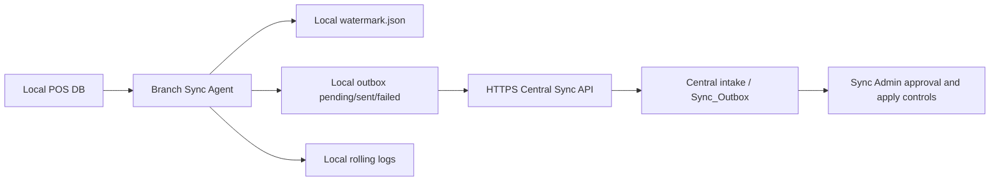

# Branch Sync Agent Architecture

## Role

The Branch Sync Agent is installed on each POS branch machine. It is a collector/sender, not an applier.

Responsibilities:

- scan local POS DB
- detect new/changed invoice candidates
- create durable local outbox payloads
- maintain local watermark
- send heartbeat
- retry safely while offline
- send payloads to central server over HTTPS API
- write local logs
- run as a Windows Service with recovery

Non-responsibilities:

- no central ApplyMode
- no invoice insertion into central DB
- no approval decisions
- no branch UI
- no direct central SQL password
- no batch apply

## Flow

## Security

- Prefer Windows Integrated Security for local POS DB access.
- Branch machine does not store central SQL credentials.
- Central API token is read from an environment variable.
- HTTPS is required when sending is enabled.
- Service should run under a dedicated least-privilege Windows identity.

## Current Implementation

Project:

`SyncBranchAgent/SyncBranchAgent.csproj`

Runtime modes:

- `SyncBranchAgent.exe --console --once`
- `SyncBranchAgent.exe --console`
- Windows Service via `ServiceBase`

Storage:

- outbox files under `%ProgramData%\Satriah\BranchSyncAgent\outbox`
- watermark under `%ProgramData%\Satriah\BranchSyncAgent\watermark.json`
- logs under `%ProgramData%\Satriah\BranchSyncAgent\logs`

Send behavior:

- `BranchAgent.EnableSend=false` by default
- `BranchAgent.DryRunSend=true` by default
- when disabled, agent scans and queues locally only
- when enabled, posts to the central Sync API routes listed below

Central API routes:

- `POST /sync/api/branch/outbox`
- `POST /sync/api/branch/heartbeat`
- `POST /sync/api/branch/outbox/{syncKey}/ack`

## Central Control Boundary

The central Admin UI remains the only place for approval and apply governance. Branch agent payloads should be treated as untrusted input until central validation, duplicate detection, profile checks, and approval gates pass.
